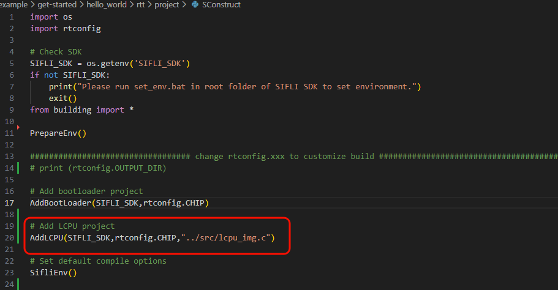
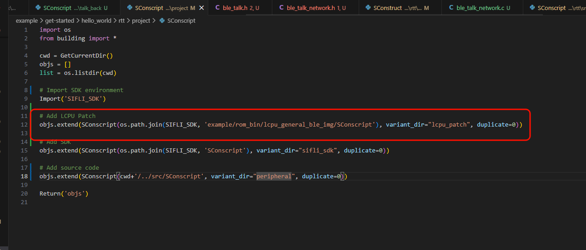

# BLE 组网对讲组件

## 1. 概述

BLE 组网对讲组件基于周期广播（Periodic Advertising）实现无连接的多人对讲功能。

组件分为两个模块：

| 模块 | 头文件 | 职责 |
|------|--------|------|
| **组网模块** | `ble_talk_network.h` | 房间创建/加入/退出/回连/解散、成员管理、超时控制、状态机 |
| **对讲模块** | `ble_talk.h` | 音频编解码管线、PTT 语音发送（周期广播）、扫描与周期同步接收 |

### 1.1 核心概念

- **Master（创建者）**：创建房间、接受 Slave 入网、确认开始对讲、解散房间。
- **Slave（参与者）**：扫描并加入已有房间、PTT 发言、退出/回连。
- **房间（Room）**：由 Master 创建的逻辑分组，以唯一 Room ID 标识。
- **PTT（Push-To-Talk）**：按住讲话、松开停止，同一时刻最多 `BLE_TALK_NETWORK_MAX_SPEAKERS` 人同时发言。

### 1.2 状态机

```
┌──────────┐  create_room / scan_rooms  ┌──────────┐
│ STANDBY  │ ─────────────────────────► │ PAIRING  │
│  (待机)   │ ◄─────────────────────────│ (配对中)  │
└──────────┘   timeout / room_full      └──────────┘
   ▲                                        │
   │                                Slave加入 / Master收到JOIN
   │                                        ▼
   │    			             ┌────────────────┐
   │   							 │ WAITING_TALK   │
   │                             │ (等待对讲)      │
   │                             └────────────────┘
   │                                      │
   │                          confirm_talking / SYNC
   │                                      ▼
   │     leave_room / abandon    ┌──────────┐
   └──────────────────────────── │ TALKING  │
                                 │ (对讲中)  │
                                 └──────────┘
```

---

## 2. 可配置参数

以下宏均支持覆盖默认值：

| 宏名 | 默认值 | 说明 |
|------|--------|------|
| `BLE_TALK_NETWORK_MAX_SPEAKERS` | 3 | 同时讲话人数上限，同时也是接收侧周期同步槽位数 |
| `BLE_TALK_NETWORK_MAX_ROOM_MEMBERS` | 8 | 房间最大成员数（含 Master） |
| `BLE_TALK_NETWORK_PAIRING_TIMEOUT_MS` | 30000 | 配对超时（ms） |
| `BLE_TALK_NETWORK_RECONNECT_TIMEOUT_MS` | 10000 | 回连超时（ms） |
| `BLE_TALK_PERIODIC_ADV_MAX_LEN` | 100 | 周期广播负载最大长度（字节） |
| `ROOM_ID_LEN` | 32 | 房间 ID 最大长度 |

---

## 3. API 快速参考

### 3.1 组网模块 (`ble_talk_network.h`)

#### 初始化与注册

| API | 说明 |
|-----|------|
| `ble_talk_network_init()` | 初始化组网组件（状态机 / 定时器 / 成员列表） |
| `ble_talk_network_advertising_init()` | 初始化扩展广播资源（BLE 上电后调用） |
| `ble_talk_network_register_callbacks()` | 注册 UI 通知回调 |
| `ble_talk_network_set_ops()` | 注册底层操作钩子 |

#### 事件转发

| API | 说明 |
|-----|------|
| `ble_talk_network_event_handler()` | 在全局 BLE 事件处理器中转发扫描/广告事件 |

#### 高层动作

| API | 调用条件 | 说明 |
|-----|---------|------|
| `ble_talk_network_create_room()` | STANDBY + Master | 创建房间并广播 |
| `ble_talk_network_scan_rooms()` | STANDBY + Slave | 扫描可用房间 |
| `ble_talk_network_confirm_talking()` | WAITING_TALK + Master | 确认开始对讲 |
| `ble_talk_network_leave_room()` | TALKING | 退出房间（Slave 保留回连 / Master 解散） |
| `ble_talk_network_reconnect()` | STANDBY + 有待回连 | Slave 回连上次房间 |
| `ble_talk_network_switch_role()` | STANDBY | 切换 Master↔Slave |
| `ble_talk_network_enter_idle()` | 任意 | 休眠前清理所有状态 |

#### 状态查询

| API | 返回值 |
|-----|--------|
| `ble_talk_network_get_phase()` | 当前阶段 `ble_talk_phase_t` |
| `ble_talk_network_get_role()` | 当前角色 `ble_talk_network_role_t` |
| `ble_talk_network_get_room_id()` | 房间 ID 字符串 |
| `ble_talk_network_is_reconnect_pending()` | 是否有待回连房间 |
| `ble_talk_network_get_speaker_count()` | 当前讲话人数 |
| `ble_talk_network_is_control_data()` | 判断数据是否为组网控制帧 |

### 3.2 对讲模块 (`ble_talk.h`)

#### 音频管线

| API | 说明 |
|-----|------|
| `talk_init(flag)` | 初始化音频编解码（AUDIO_TX / AUDIO_RX / AUDIO_TXRX） |
| `talk_deinit()` | 释放音频资源 |

#### 发送侧

| API | 说明 |
|-----|------|
| `ble_app_sender_init()` | 初始化发送器 |
| `ble_app_sender_trigger()` | PTT 按下 —— 开始发送 |
| `ble_app_sender_stop()` | PTT 松开 —— 停止发送 |
| `ble_app_peri_advertising_init()` | 初始化周期广播（BLE 上电后调用） |

#### 接收侧

| API | 说明 |
|-----|------|
| `ble_app_scan_init()` | 初始化扫描 + 创建周期同步 |
| `ble_app_scan_enable()` / `ble_app_scan_stop()` | 开启 / 停止扫描 |
| `ble_app_receviver_init()` | 初始化接收器 |
| `ble_app_receiver_event_handler()` | 转发周期同步相关 BLE 事件 |
| `ble_app_receiver_get_synced_num()` | 查询已同步设备数 |

---

## 4. 需要开启的宏开关
1. 启用 RT-Thread 系统工作队列
    - 路径： RTOS → RT-Thread Components → Device Drivers
    - 开启： Using system default workqueue
        - 宏开关：`CONFIG_RT_USING_SYSTEM_WORKQUEUE`
        - 作用：启用 RT-Thread 系统工作队列
2. 启用 RT-Thread 统一日志框架
    - 路径：RTOS → RT-Thread Components → Utilities
    - 开启：Enable ulog
        - 宏开关：`CONFIG_RT_USING_ULOG`
        - 作用：提供 LOG_D / LOG_I 等分级日志打印
3. 使能蓝牙(`BLUETOOTH`)：
    - 路径：Sifli middleware → Bluetooth
    - 开启：Enable bluetooth
        - 宏开关：`CONFIG_BLUETOOTH`
        - 作用：使能蓝牙功能
4. 启用按键库
    - 路径：Sifli middleware 
    - 开启：Enable button library
        - 宏开关：`CONFIG_USING_BUTTON_LIB`
        - 作用：启用按键库
5. 启用对讲组网组件
    - 路径：Sifli middleware 
    - 开启：Enable Talk Back
        - 宏开关：`CONFIG_USING_TALK_BACK`
        - 作用：启用对讲组网组件
6. 启用Audio
    - 路径：Sifli middleware → Bluetooth
    - 开启：Enable bluetooth
        - 宏开关：`CONFIG_BLUETOOTH`
        - 作用：使能蓝牙功能
7. 使能RT_USING_RTT_CMSIS
    - 路径：Third party packages
    - 开启：Enable RT-Thread support for CMSIS OS
        - 宏开关：`CONFIG_RT_USING_RTT_CMSIS`
        - 作用：启用 CMSIS-RTOS2 兼容层
8. 启用 Opus 编解码
    - 路径：Third party packages
    - 开启：libopus
        - 宏开关：`CONFIG_PKG_LIB_OPUS`
        - 作用：启用 Opus 编解码库
9. 启用 WebRTC 音频处理
    - 路径：Third party packages
    - 开启：WebRTC: The real-time speech enhancement processing
        - 宏开关：`CONFIG_PKG_USING_WEBRTC`
        - 作用：启用 WebRTC 音频处理库

## 5. 从零集成指南

```
步骤 1: 初始化组件
步骤 2: 注册组网回调（UI / LED）
步骤 3: 注册底层操作钩子
步骤 4: 注册对讲回调
步骤 5: BLE 上电后初始化广播与扫描
步骤 6: BLE 事件转发
步骤 7: 按键 / 业务逻辑状态机
```

---


## 6. 集成模板代码

将以下模板复制到你的 `main.c`，按注释提示完成 **必须实现** 的部分即可使用组网对讲功能。

```c
#include <rtthread.h>
#include <rtdevice.h>
#include <board.h>
#include <string.h>

#include "ble_talk_network.h"        /* 组网模块 */
#include "ble_talk/ble_talk.h"       /* 对讲模块 */

#include "bf0_ble_gap.h"
#include "bf0_sibles.h"
#include "bf0_sibles_advertising.h"
#include "button.h"


/* ======================== 应用层状态（按需修改） ========================== */

static uint8_t g_is_talking = 0;     /* PTT 发言标志 */

/* 查询本机是否正在发言（组网组件内部使用） */
static uint8_t app_is_speaking(void)
{
    return g_is_talking;
}

static void app_on_phase_changed(ble_talk_phase_t old_phase,
                                 ble_talk_phase_t new_phase)
{
    ble_talk_network_role_t role = ble_talk_network_get_role();
    (void)old_phase;

    switch (new_phase)
    {
    case BLE_TALK_PHASE_STANDBY:
        /* TODO:【必须实现】处理待机状态 */
        rt_kprintf("进入待机状态\n");
		/*切换ui，切换灯光等操作*/
        break;
    case BLE_TALK_PHASE_PAIRING:
        /* TODO:【必须实现】处理配对中状态 */
        rt_kprintf("进入配对中状态\n");
        break;
    case BLE_TALK_PHASE_WAITING_TALK:
        /* TODO:【必须实现】处理等待对讲状态 */
        rt_kprintf("进入等待对讲状态\n");
        break;
    case BLE_TALK_PHASE_TALKING:
        /* TODO:【必须实现】处理对讲中状态 */
        rt_kprintf("进入对讲中状态\n");
        break;
    }
}

/* 配对超时通知 —— 组件已自动回到 STANDBY */
static void app_on_pairing_timeout(void)
{
    /* TODO: 可选 —— 播放提示音或更新 UI */
    rt_kprintf("配对超时\n");
}

/* 回连超时通知 —— 组件已自动回到 STANDBY */
static void app_on_reconnect_timeout(void)
{
    /* TODO: 可选 —— 播放提示音或更新 UI */
    rt_kprintf("回连超时\n");
}

/* 房间满员通知 —— 本机被拒绝加入，组件已自动回到 STANDBY */
static void app_on_room_full(void)
{
    /* TODO: 可选 —— 播放提示音或更新 UI */
    rt_kprintf("房间满员，无法加入\n");
}

/* ======================== 步骤 4: 对讲回调 =============================== */

/* 扫描状态变化（可选） */
static void app_on_scan_state_changed(uint8_t is_scanning)
{
    (void)is_scanning;
}

/* 周期同步建立 —— synced_num 为当前已同步设备数 */
static void app_on_receiver_synced(uint8_t synced_num)
{
    /* TODO: 可选 —— 例如切换指示灯表示已收到音频流 */
    (void)synced_num;
    rt_kprintf("开始对讲\n");
}

/* 周期同步断开 */
static void app_on_receiver_sync_stopped(uint8_t synced_num)
{
    /* TODO: 可选 —— 例如所有同步断开时恢复默认指示灯 */
    (void)synced_num;
    rt_kprintf("对讲结束\n");
}

/* ======================== 步骤 6: BLE 事件转发 =========================== */
int ble_app_event_handler(uint16_t event_id, uint8_t *data,
                          uint16_t len, uint32_t context)
{
    switch (event_id)
    {
    /* ---- BLE 上电 ---- */
    case BLE_POWER_ON_IND:
    {
        /* 步骤 5: BLE 上电后初始化广播与扫描资源 */
        ble_app_scan_init();                       /* 对讲: 扫描 + 周期同步 */
        ble_app_peri_advertising_init();           /* 对讲: 周期广播 */
        ble_talk_network_advertising_init();       /* 组网: 扩展广播 */
        break;
    }

    /* ---- 扫描 & 扩展广告事件 ---- */
    case BLE_GAP_SCAN_START_CNF:
    case BLE_GAP_SCAN_STOP_CNF:
    case BLE_GAP_SCAN_STOPPED_IND:
    case BLE_GAP_EXT_ADV_REPORT_IND:
    {
        /* 同时转发给组网组件和对讲组件 */
        ble_talk_network_event_handler(event_id, data, len, context);
        ble_app_receiver_event_handler(event_id, data, len, context);
        break;
    }

    /* ---- 周期同步事件（仅对讲组件处理） ---- */
    case BLE_GAP_CREATE_PERIODIC_ADV_SYNC_CNF:
    case BLE_GAP_START_PERIODIC_ADV_SYNC_CNF:
    case BLE_GAP_DELETE_PERIODIC_ADV_SYNC_CNF:
    case BLE_GAP_PERIODIC_ADV_SYNC_CREATED_IND:
    case BLE_GAP_PERIODIC_ADV_SYNC_STOPPED_IND:
    case BLE_GAP_PERIODIC_ADV_SYNC_ESTABLISHED_IND:
    {
        ble_app_receiver_event_handler(event_id, data, len, context);
        break;
    }

    default:
        break;
    }
    return 0;
}
BLE_EVENT_REGISTER(ble_app_event_handler, NULL);

/* ======================== 步骤 7: 业务逻辑 ============================== */
/* ------------------------------------------------------------------------ */
/*                                             		  业务逻辑代码           */
/*   以下演示了完整的按键映射，你可以根据实际硬件修改触发方式。                  */
/* ------------------------------------------------------------------------ */

/*
 * 示例: 按键 A —— 退出房间 / 回连
 */
static void on_key_a_click(void)
{
    ble_talk_phase_t phase = ble_talk_network_get_phase();

    if (phase == BLE_TALK_PHASE_TALKING)
    {
        /* 退出房间 */
        ble_talk_network_leave_room();
        g_is_talking = 0;
    }
    else if (phase == BLE_TALK_PHASE_STANDBY &&
             ble_talk_network_is_reconnect_pending())
    {
        /* Slave 回连上次房间 */
        ble_talk_network_reconnect();
    }
}

/*
 * 示例: 按键 B 短按 —— 切换 Master/Slave
 */
static void on_key_b_click(void)
{
    if (ble_talk_network_get_phase() != BLE_TALK_PHASE_STANDBY)
        return;

    ble_talk_network_role_t new_role = ble_talk_network_switch_role();
    /* TODO: 更新 UI 显示当前角色 */
    (void)new_role;
}

/*
 * 示例: 按键 B 长按 —— 配对 / 确认对讲
 */
static void on_key_b_long_press(void)
{
    ble_talk_phase_t phase = ble_talk_network_get_phase();
    ble_talk_network_role_t role = ble_talk_network_get_role();

    if (phase == BLE_TALK_PHASE_STANDBY)
    {
        if (role == BLE_TALK_NETWORK_INITIATOR_ROLE)
            ble_talk_network_create_room();      /* Master 创建房间 */
        else
            ble_talk_network_scan_rooms();       /* Slave 扫描房间 */
    }
    else if (phase == BLE_TALK_PHASE_WAITING_TALK &&
             role == BLE_TALK_NETWORK_INITIATOR_ROLE)
    {
        ble_talk_network_confirm_talking();       /* Master 确认开始对讲 */
    }
}

/*
 * 示例: PTT 按住 / 松开
 */
static void on_ptt_pressed(void)
{
    if (ble_talk_network_get_phase() != BLE_TALK_PHASE_TALKING)
        return;
    if (ble_app_receiver_get_synced_num() == 0 &&
        strlen(ble_talk_network_get_room_id()) == 0)
        return;

    if (!g_is_talking)
    {
        if (ble_app_sender_trigger() == 0)
            g_is_talking = 1;
    }
}

static void on_ptt_released(void)
{
    if (g_is_talking)
    {
        ble_app_sender_stop();
        g_is_talking = 0;
    }
}

/* ======================== 按键硬件适配 ================================== */

/*
 * KEY1 事件处理：短按退出房间 / 回连
 */
static void ble_app_button_event_handler(int32_t pin, button_action_t action)
{
    if (action == BUTTON_CLICKED)
    {
        on_key_a_click();
    }
}

/*
 * KEY2 事件处理：PTT 按住/松开、短按切换角色、长按配对/确认
 */
static void ble_app_key2_event_handler(int32_t pin, button_action_t action)
{
    if (action == BUTTON_PRESSED)
    {
        on_ptt_pressed();
    }
    else if (action == BUTTON_RELEASED)
    {
        on_ptt_released();
    }

    if (action == BUTTON_CLICKED)
    {
        on_key_b_click();
    }
    else if (action == BUTTON_LONG_PRESSED)
    {
        on_key_b_long_press();
    }
}

/*
 * 按键初始化：注册 KEY1 / KEY2 事件处理器
 */
static void ble_app_button_init(void)
{
    button_cfg_t cfg;

    cfg.pin = BSP_KEY1_PIN;
    cfg.active_state = BSP_KEY1_ACTIVE_HIGH;
    cfg.mode = PIN_MODE_INPUT;
    cfg.button_handler = ble_app_button_event_handler;
    int32_t id = button_init(&cfg);
    RT_ASSERT(id >= 0);
    RT_ASSERT(SF_EOK == button_enable(id));

    cfg.pin = BSP_KEY2_PIN;
    cfg.active_state = BSP_KEY2_ACTIVE_HIGH;
    cfg.mode = PIN_MODE_INPUT;
    cfg.button_handler = ble_app_key2_event_handler;
    int32_t id2 = button_init(&cfg);
    RT_ASSERT(id2 >= 0);
    RT_ASSERT(SF_EOK == button_enable(id2));
}

/* ======================== 主函数 ======================================== */

int main(void)
{
    /* ---- 步骤 1: 初始化组件 ---- */
    ble_talk_network_init();

    /* ---- 步骤 2: 注册组网回调 ---- */
    ble_talk_network_callbacks_t net_cbs = {
        .on_phase_changed     = app_on_phase_changed,
        .on_pairing_timeout   = app_on_pairing_timeout,
        .on_reconnect_timeout = app_on_reconnect_timeout,
        .on_room_full         = app_on_room_full,
    };
    ble_talk_network_register_callbacks(&net_cbs);

    /* ---- 步骤 3: 注册底层操作钩子 ---- */
    ble_talk_network_ops_t ops = {
        .scan_enable = (void (*)(void))ble_app_scan_enable,   /* 对讲组件已实现 */
        .scan_stop   = (void (*)(void))ble_app_scan_stop,     /* 对讲组件已实现 */
        .is_speaking = app_is_speaking,                       /* 已在模板中实现 */
        .sender_stop = (void (*)(void))ble_app_sender_stop,   /* 对讲组件已实现 */
    };
    ble_talk_network_set_ops(&ops);

    /* ---- 步骤 4: 注册对讲回调 ---- */
    ble_talk_callbacks_t talk_cbs = {
        .on_scan_state_changed    = app_on_scan_state_changed,
        .on_receiver_synced       = app_on_receiver_synced,
        .on_receiver_sync_stopped = app_on_receiver_sync_stopped,
    };
    ble_talk_register_callbacks(&talk_cbs);

    /* ---- 步骤 5: 初始化对讲音频 & 启用 BLE ---- */
    sifli_ble_enable();

    ble_app_sender_init();
    ble_app_receviver_init();

    /* ---- 步骤 7: 按键初始化 ---- */
    ble_app_button_init();


    /* 主循环 */
    while (1)
    {
       
        rt_thread_mdelay(1000);
    }
    return 0;
}
```

---

## 7. 典型交互时序

### 7.1 配对入网

```
     Master                          Slave
       │                               │
       │── create_room() ──►           │
       │   (广播 START + room_id)       │
       │                               │── scan_rooms()
       │                               │   (扫描中...)
       │   ◄── 收到 START ─────────────│
       │                               │── 自动发送 JOIN
       │── 收到 JOIN ──────────────────│
       │   (添加成员, 进入 WAITING_TALK) │
       │                               │── 进入 WAITING_TALK
       │                               │
       │── confirm_talking() ──►       │
       │   (广播 SYNC)                  │
       │                               │── 收到 SYNC
       │── 进入 TALKING                │── 进入 TALKING
       │                               │
```

### 7.2 PTT 对讲

```
     Speaker                      Listener(s)
       │                               │
       │── sender_trigger() ──►        │
       │   (周期广播音频帧)              │
       │                               │── 周期同步接收
       │                               │── ble_talk_downlink() 回放
       │                               │
       │── sender_stop() ──►           │
       │   (停止周期广播)                │
       │                               │
```

### 7.3 退出与回连

```
     Slave                           Master
       │                               │
       │── leave_room() ──►            │
       │   (广播 ABANDON)               │
       │   保存 last_room_id            │── 收到 ABANDON
       │── 回到 STANDBY                │   (从成员列表移除, 加入回连白名单)
       │                               │
       │  (稍后按键触发回连)              │
       │── reconnect() ──►             │
       │   (广播 JOIN + last_room_id)   │
       │                               │── 收到 JOIN (白名单匹配)
       │                               │── 发送 REJOIN_ACK
       │── 收到 REJOIN_ACK             │
       │── 进入 TALKING                │
       │                               │
```

---

## 8.常见问题
**Q: 宏开关都配置好了，但是程序跑起来发现广播功能失效？**  
A: 查看项目工程project目录下的SConscript与SConstruct文件，确认是否将Lcpu参与编译



